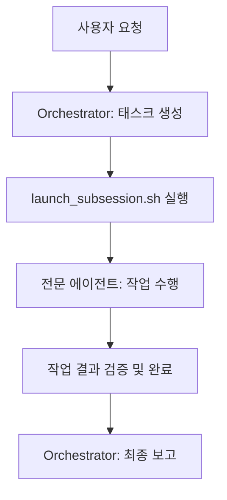

# GIIP Agent System: Autonomous Multi-Agent Framework 🤖

[](https://opensource.org/licenses/MIT)
[](http://makeapullrequest.com)
[](#-핵심-규칙)
[](https://aistudio.google.com/app/apikey)

**GIIP Agent System**은 복잡한 소프트웨어 개발 및 작업 자동화를 위해 설계된 **자율형 멀티 에이전트 프레임워크(Autonomous Multi-Agent Framework)** 입니다. Google Gemini API를 활용하여 오케스트레이터(Orchestrator)와 전문 서브 에이전트들이 협업하는 최첨단 AI 워크플로우를 제공합니다.

이 프레임워크는 **Claude Code의 skills** 나 **OpenCode** 와 유사한 **롤 베이스 서브 에이전트(Role-based Sub-Agents)** 개념을 채택하여, 복잡한 태스크를 정교하게 분담하고 해결합니다. 

특히 **Antigravity Tool**에 최적화되어 설계되었으며, 별도의 서드파티 툴 설치 없이 기존의 개발 툴과 PowerShell 환경만으로 즉시 구동됩니다. Electron 베이스의 터미널 환경에서도 뛰어난 안정성과 호환성을 제공합니다.

한국 개발자 생태계(Korean Developer Ecosystem)에 최적화되어 있으며, 모든 프로세스와 문서화는 **Korean-First** 원칙을 따릅니다.

## ✨ 핵심 기능 (Key Features)

- **Multi-Agent Collaboration**: Claude Code/OpenCode 스타일의 롤 기반 협업.
- **Autonomous Development**: 요구사항 분석부터 구현, 검증까지 자율적인 태스크 수행.
- **Antigravity Optimized**: Antigravity 툴과의 완벽한 싱크 및 최적화된 워크플로우.
- **Zero-Tool Setup**: 추가적인 툴 설치 없이 기존 Bash/Zsh 환경에서 즉시 사용 가능.
- **Environment Stability**: Electron 베이스의 터미널 환경에서 완벽하게 작동.
- **Gemini API Native**: 최신 Google Gemini 모델을 활용한 고성능 추론 및 코드 생성.
- **Korean-First Workflow**: 한국어 기반의 문서화 및 에이전트 상호작용 최적화.
- **React Best Practices**: Vercel의 React Best Practices Rules 적용으로 최적화된 Frontend 코드 생성.

이 레포지토리는 GIIP AI Agent 시스템의 설정, 역할 정의 및 워크플로우를 관리하기 위한 공간입니다. 

실제로 사용하는 sub agent용 role의 정의나 필요한 기능만을 `.agent` 폴더에 모아놨기 때문에 기존 프로젝트에 이 레포지토리의 내용을 그대로 덮어써도 기존 프로젝트는 영향을 받지 않습니다. 

여러분이 작업하시는 폴더에 이 레포지토리의 파일과 디렉토리를 복사한 뒤에 antigravity를 기동해보세요. 그리고 다음과 같이 채팅을 입력하시면 준비는 끝납니다. 

```
넌 오케스트레이터야. 너의 롤을 확인하고 나에게 설명해봐.
```

이제 여러분은 지금 채팅 화면에서 업무 지시를 할 수 있게 됩니다.

## 🛠️ 사전 준비 사항 (Prerequisites)

이 시스템을 사용하기 위해 다음 도구들이 설치되어 있어야 합니다:

1. **Bash/Zsh**: [설치 가이드](https://learn.microsoft.com/ko-kr/powershell/scripting/install/installing-powershell-on-windows)
2. **Node.js**: [공식 사이트](https://nodejs.org/)에서 LTS 버전을 권장합니다.
3. **Gemini CLI**: 터미널에서 아래 명령어를 실행하여 전역 설치하십시오.
   ```bash
   npm install -g @google/gemini-cli
   ```

## ⚙️ 초기 설정 (Setup & Configuration)

### 1. API Key 설정
Gemini API를 사용하기 위해 API Key 설정이 필요합니다.
(수동 시작만을 사용할 경우에는 필요 없습니다.)

우선 antigravity 툴에서 에이전트 스크립트를 분석하여 setting.json 샘플 파일을 만들어달라고 요청하면 파일이 만들어집니다.

1. [Google AI Studio](https://aistudio.google.com/app/apikey)에서 API Key를 발급받습니다.
2. 프로젝트 루트의 `.agent/settings.json.sample` 파일을 동일한 폴더에 `settings.json`으로 복사합니다.
3. 복사한 `settings.json` 파일을 열고 `"YOUR_GEMINI_API_KEY_HERE"` 부분을 발급받은 실제 키로 교체합니다.

> [!NOTE]
> `launch_subsession.sh` 스크립트는 프로젝트 내의 `.agent/settings.json`을 가장 먼저 확인하며, 없을 경우 사용자의 홈 디렉터리(`~/.gemini/settings.json`)를 참조합니다.

## 📁 디렉토리 구조 (Directory Structure)

```text
.agent/
├── roles/          # 각 에이전트(Developer, Tester 등)의 페르소나와 책임 정의
├── dispatch/       # 태스크 정의 파일 (TASK_YYYYMMDD-ID.md)
├── scripts/        # [시스템 운영을 위한 Bash 스크립트 도구](./.agent/scripts/README.md)
├── work_history/   # 작업 이력 기록 (Rule compliance)
└── README.md       # 시스템 상세 가이드 (한글)
```

## 🚀 주요 사용법 (Basic Usage)

에이전트 세션을 시작하는 두 가지 방법이 있습니다:

### 1. 자동 시작 (gemini-cli 사용 시)
보류 중인 태스크를 자동으로 감지하고 적절한 역할로 `gemini-cli` 세션을 즉시 시작합니다.
```bash
./.agent/scripts/launch_subsession.sh
```

- 주기적 자동 실행 (배치 파일 사용)
에이전트를 5분마다 자동으로 확인하여 작업을 수행하도록 설정할 수 있습니다.
```bash
./auto_agent.sh
```
이 스트립트는 실행 중인 창을 유지하며 5분(300초) 간격으로 `launch_subsession.sh`을 반복 호출합니다.

### 2. 수동 시작 (클립보드 핸드오프)
`gemini-cli` 없이 에이전트 매니저 등의 환경에서 새로운 세션으로 작업을 붙여넣고 싶을 때 사용합니다. 보류 중인 작업을 찾아 해당 역할의 컨텍스트를 클립보드에 복사합니다.
```bash
./.agent/scripts/launch_role.sh
```
실행 후, 에이전트와 대화 중인 창에 `Ctrl+V`로 붙여넣어 작업을 시작하십시오.(agent manager에서 새 대화(왼쪽에 플러스 버튼)를 만들어 붙여 넣는게 가장 확실함.)

## 📊 상태 확인 및 모니터링 (Monitoring & Status)
모든 태스크의 진행 상태와 현재 실행 중인 백그라운드 프로세스를 확인합니다.
```bash
./.agent/scripts/check_status.sh
```

### 3. 작업 이력 확인
에이전트들의 모든 작업 내역은 `work_history` 디렉토리에 날짜별로 기록됩니다.

## 🚨 핵심 규칙 (Core Principles)
모든 에이전트는 다음 규칙을 엄격히 준수합니다:
1.  **Evidence First**: 기술적 근거는 항상 마크다운 파일로 링크하여 제시합니다.
2.  **Korean First**: 모든 결과물과 문서는 한글로 작성하는 것을 원칙으로 합니다.
3.  **Clean Code**: 가독성 높고 유지보수가 용이한 코드를 작성하며, 불필요한 중복을 제거합니다.

## 🔄 에이전트 워크플로우 (Agent Workflow)



1.  **오케스트레이터**가 요청을 분석하고 `dispatch` 디렉토리에 태스크를 생성합니다.
2.  사용자 또는 시스템이 `launch_subsession.sh`을 실행합니다.
3.  **서브 에이전트**(예: Developer, Tester)가 작업을 수행하고 상태를 `Completed`로 업데이트합니다.

4.  **오케스트레이터**가 최종 결과물을 검증합니다.
 
## 🌐 GIIP Enterprise Managed Service
 
더욱 강력하고 안정적인 시스템 운영이 필요하신가요? **GIIP**는 인프라 자동 관리 및 보안 위협 탐지를 위해 전문가와 AI의 협업 모델을 제공합니다.
 
- **인프라 자동화**: 반복적인 운영 업무를 AI가 대신 수행합니다.
- **보안 위협 탐지**: 실시간으로 위협을 감지하고 신속하게 대응합니다.
- **전문가 협업**: AI의 효율성과 전문가의 판단력을 결합하여 최상의 품질을 보장합니다.
 
복잡한 관리는 전문가에게 맡기고 비즈니스 본질에 집중하세요.

👉 [GIIP 공식 홈페이지 방문하기](https://giip.littleworld.net/)

## 🙏 Special Thanks

이 프로젝트에 도움을 주신 분들께 감사드립니다:

- [Roy Koo](https://www.linkedin.com/in/roykoo99/)
- [코드깎는노인](https://www.youtube.com/@%EC%BD%94%EB%93%9C%EA%B9%8E%EB%8A%94%EB%85%B8%EC%9D%B8)


